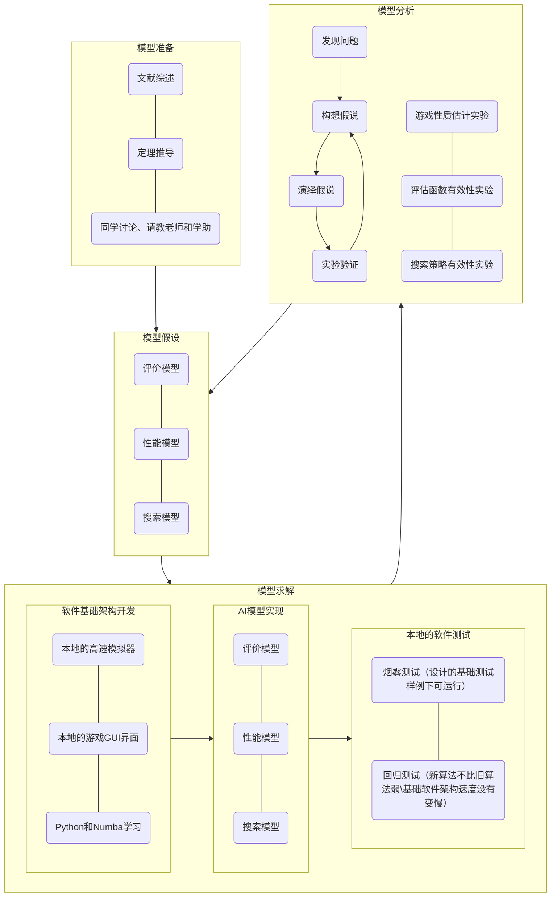

# 南方科技大学-CS303_311-人工智能-大作业

#### 介绍

这是南方科技大学CS303/311人工智能课程的大作业——玩转黑白棋。This is the project of CS303/311 Artificial Intelligence course in Southern University of Science and Technology, which is to design AI to play Reverse Reversi. 

#### 软件架构

Python

#### 安装教程

1. xxxx
2. xxxx

#### 使用说明

1. xxxx
2. xxxx
#### 研发阶段

1. 基础软件架构
- 超时
- AI与模拟器与GUI分离
- Python语法探究与OJ部署
2. 评估函数调优
- 本地对抗实验
- 理论推导
- 演化计算
- 论文学习
3. 搜索算法调优
- 同函数不同深度的实验
- MCTS
- 论文学习
4. 搜索算法时间利用
- IDS
- MCTS 实验次数
- numba优化
- 论文学习
5. 参考文献生成
- citation machine
- zetero
- Markdown 学术

#### 参与贡献

1. Fork 本仓库

2. 新建 Feat_xxx 分支

3. 提交代码

4. 新建 Pull Request

   

#### 特技

1. 
