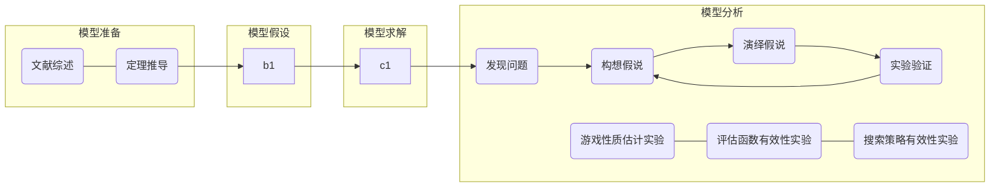

# AI Project1: Development of a superb AI Program for Reversed Reversi 

叶璨铭，12011404@mail.sustech.edu.cn

[TOC]

## Introduction

In this project, we tries to develop a **high-level *Reversed Reversi* program** that are compatible to beat our classmates' programs. **Our purpose is not seeking to prevail over others, but to master the essence of AI system development by learning from and communicating with each other.**

 As Kronrod says, computer board game is the "fruit fly in Artificial Intelligence".[^1][^2] This interesting computer game project will definitely provide me with **a better understaning** of the **knowledge I learnt in the AI course** via my **hand-by-hand practice and experiments** in the procedure of accomplishing this project. 

### Problem background

**Reversi**, also called Othello, is a **deterministic, turn-taking, two-player, zero-sum** game of perfect information.[^1]Reversi is not popular in China before the development of the Internet.[^6] Although it may not often appears as a board game, it is indeed popular in the research of computer game because of its relatively small search space. [^1][^2]Computers have always excelled in Reversi because average human players cannot envision the drastic board change caused by move[^10], and because human players dislike to risk taking a seemingly bad but actually best move.[^7] 

**Reversed Reversi,** also called the anti mode of Othello, shares the same dynamics of the chessboard enviroment as Reversi, while the objective is the opposite. [^7]In the game, each player places a piece of his color on the board, flipping any opponent's pieces that are bracketed along a line.  The object of the **Reversi** is to have the **most discs** turned to display your color when the last playable empty square is filled, while **Reversed Reversi** expects the winner to have the **least discs.**[^8] A formal definition of the game rules of Reversed Reversi will be presented in Part 2.

### Literature review

Before we start to develop our own algorithms for Reversed Reversi, it is necessary for us to do a literature review on how previous researchers develop programs that play Reversi, Reversed Reversi and other board games. 

#### Normal Reversi program 

The first world class Reversi program is *IAGO* developed by Rosenbloom in 1982. This program effectively quantified Reversi maxims into efficient algorithms with adversial search techniques. [^10]Later in 1990, 李开复& Mahajan developed another program called *BILL*, which far surpassed the *IAGO* by introducing dynamic evaluation function based on Bayesian learning. [^10][^2]Although *IAGO* and *BILL* are best computer programs that play Reversi at their times, the top human players were not beaten untill the occurence of the program *Logistello* developed by Buro in 1997.[^1]The main new idea of *Logistello* is that it automatically learns from previous plays[^6][^7]**After that, it is generally acknowledged that humans are no match for computers at Reversi.**[^1] 

In 1997-2006, Andersson developped a practical Reversi program called *WZebra*. It has big opening books, state-of-the-art search algorithms, pattern-based evaluation scheme that can stably run on Windows 2000 to even today's Windows 11 platforms. [^11]While it gains a better performace and stability by applying several techniques of C Programming Launguage, the basic ideas of *WZebra*, however, are no more than *BILL*'s or *Logistello*'s.  

#### Reversed Reversi program

While it is often the case that reversed board game is easy and boring, such as reversed  Chinese Chess, Go and Chess,   R**eversed Reversi is worth playing and it is an art to play it well**. [^7]According to MacGuire, much of the strategic thinking behind the classic game can also be applied to the reverse game, though sometimes in reverse.[^9]

Tothello, a program developed by Pittner, is believed to be the best  program in the world playing Reversed Reversi untill 2006. [^7]

#### General board game program

## Preliminary

In the last part, we have known the background of the problem and found some useful references. Next, we need to **formulate** the problem in formal language to **disambiguate the potential confusion.**[^8]With the formal logic system, we can then **derive some basic theorems and corollaries** that any Reversed Reversi game must logically follows. With this knowledge in our minds, it is clear how to design our models and experiments in the next sections.

### Problem formulation and notations

Informally, the Reversed Reversi problem is to build a program playing Reversed Reversi with some kinds of high *Intelligence*. 

Formally, this problem can be formulated as a **Task Enviroment,** which is specified by a tuple $(P, E, A, S)$, where P is the performance measure, E is the enviroment, A is the actuators, and S is the sensors. 

Besides problem, we also need to formulate the program. The program for this problem can be formulated as an **Agent Algorithm**, which is specify by a function G, mapping the agents' percept histories to its action. 

Now we formulate P, E, A, S and G respectively. 

#### Enviroment E, Actuators A and Sensors S

Enviroment E, Actuators A and Sensors S are defined by the following notations：

|        Notation         | Interpretation                                               | Restrictions                                                 |
| :---------------------: | ------------------------------------------------------------ | ------------------------------------------------------------ |
|            n            | The chessboard size. Reversed Reversi typically has 4x4, 6x6 and 8x8 modes. | $n>=4\and n\mod2=0$                                          |
|           $t$           | The round number. **Notice that in our convention, round 0-3 exists and is played by the environment. The two agents begin to play at round 4.** | $t\in \N \and t<=n^2$                                        |
|      $i = (x, y)$       | The row index and the column index.                          | $I = \{(x,y)\in \N^2| 0<=x, y<n\}\\i\in I$                   |
|          $C_t$          | The color that moves at round t. There are 3 possible colors, 0, 1 and -1. Two agents controls only 1 or -1. | $C=\{0,1,-1\}\\C_t\in C \and C_t=2\cdot(t\mod2)-1$           |
|          $S_t$          | The state of chessboard at round t. It is a nxn matrix with color values. | $S = I\rightarrow C\\S_t: S$                                 |
| $S_t(x,y)=S_{t}((x,y))$ | The color at (x, y) on the chessboard at round t.            | $S_t(x,y)\in C$                                              |
|     $ACTIONS(s, c)$     | A set of legal indexes given chessboard state and the color. | $ACTIONS(s, c)\in 2^I $                                      |
|    $RESULT(s, c,i)$     | The result chessboard after placing index i of color c on chessboard s. | $RESULT:\{(s,c,i)|i\in \\ACTIONS(s,c)\}\rightarrow S$        |
|  $TERMINAL-TEST(s, c)$  | Whether the chessboard s is a terminated state of the game. It is not related to c in this game, but sometimes it does. | $TERMINAL-TEST: (S\times {-1,1})\rightarrow \{T, F\}$        |
|      UTILITY(s, c)      | For terminated states, defines the reward or profit for player c. UTILITY for the same board and different color must be zero-sumed. | $UTILITY(s, c): \\(\{s\in S|TERMINAL-TEST(s)\}\times\{-1,1\})\rightarrow \R \\UTILITY(s, c)+UTILITY(s, -c)=0$ |
|         TO, MO          | Time out and memory out for agent.                           | In unit of seconds and in unit of bytes.                     |

On top of restrictions on something like domains and ranges, we have some definition for these functions.
$$
TERMINAL-TEST(s)\iff |ACTIONS(s, c)|=0 \and  |ACTIONS(s, -c)|=0  \\ 

UTILITY(s, c)= sign(|\{(i, j)|s(i,j)==-c\}|-|\{(i, j)|s(i,j)==c\}|)
$$

As for ACTIONS and RESULT, it is inconvenient to use first order language to describe. According to Wang, such knowledge is called **Procedural Knowledge**, to be distinguished from Declarative Knowledge, and **it is better be represented in a well defined and standardized procedural programming language**, such as Python. [^13]

Therefore,  our formal definitions for this two function are in Python, and for paper shortage you shall read it on my [github](https://github.com/2catycm/SUSTech-CS303_311-Artificial-Intelligence-Project/blob/master/src/project1/experimental/minimax迭代加深机.py) (look at `actions` and `updated_chessboard` method at the beginning of the file for ACTIONS and RESULT).

> Interlude: 概念辨析——任务环境(Task Enviroment)和智能体（Agent）的概念的区别与联系
>
> **为什么任务环境和智能体都有感受器（Sensors）和效应器（Actuators）？**
>
> - 你可能注意到了，我们认为感受器和效应器是任务环境的一部分，而感受器和效应器也是Agent的一部分。[^1]《人工智能现代方法》中这个令人困惑的表述是怎么回事呢？
> - 其实很容易理解。
> - 任务环境是一个对Agent要解决的问题的一个模型，为Agent解决问题提供了一个平台。
>   - 在本次Project中，我们可以认为老师和学助提供的OJ对战平台和最后用同学之间两两对战的方式给我们Project打分的方式就是一个完整的任务环境。
>   - 我们刚才做的就是对这个任务环境的形式化描述。
>   - 任务环境的风格直接影响到Agent程序的适当设计.[^1]
>     - 因此，OJ对战平台使用什么接口调用我们的Agent程序、提供了什么信息、有什么规则是已知的，这些任务环境的性质都影响着我们的编程。
> - 智能体包含传感器、效应器和算法。每一时刻Agent接收感知之后通过算法将感知序列映射到其效应器应采取的行动。[^1]
>   - Agent的感受器和效应器包含在Task Environment当中，确实是两个有交叉的概念。[^1]**因此我们的形式化定义当中只把Agent的Algorithm G单独拿出来和Task Environment并列**。
>   - AIMA一书选择这么区分，在于Agent的理性程度的度量、Agent的设计方法，都与任务环境中对Agent的传感器与效应器的限制有关。[^1]
> - **因此，可以认为OJ对战平台允许我们通过改写`go(chessboard)->candidate_list`的方法来获得棋盘信息、返回控制信息，就是任务环境规定的Agent必须拥有的感受器和效应器.**
>   - 此外，尽管并不是很明显，**OJ服务器的内存的读写、CPU的使用，也是我们Agent的传感器和效应器。**作为任务环境的一部分，它限制我们的Agent必须在合理时间内(5s)以合理的存储(100MB)计算得到结果。

#### Agent Algorithm G

G is a function that maps percept histories to an action. We will implement this function by search model. 
$$
A = P^t\rightarrow I \\
G:A\\
P = S\times \{1, -1\}
$$

#### Performance P

There are 4 ways to define intelligence, and we choose rationality of actioning. [^1]And to measure the rationality of an agent, we 

needs not only performance, but also the knowlege, action, and perception that an agent is able to obtain.[^1] Approximately, performance is the most important measure for rationality. 

In this project, 30 agent algorithms, numbered $G_0, G_1, ..., G_{29} $ from 30 students are uploaded to the OJ, and 30 agents are played in   round robin, i.e. each agents are obliged to playe with another agent exactly twice. [^8]
$$
SCORE(G_0, G_1) = (UTILITY(s_0, c_0)+UTILITY(s_0, -c_0), \\UTILITY(s_1, c_1)+UTILITY(s_0, -c_1), 0, ..., 0)\\
SCORES(G_{0:29}) = \sum_{0\le i\lt j\le29}SCORE(G_i, G_j)
$$
where $s_0$ is the final chessboard when $G_0$ is of color $c_0$, and $s_1$ is the final chessobard when $G_0$ is of color $c_1$.

So the performance for our agent, say $G_i$ is 
$$
Perf(G_i) = 	SCORES(G_{0:29})[i] / sum(SCORES(G_{0:29}))
$$

> Interlude: 概念辨析——任务环境(Task Enviroment)和智能体（Agent）的概念的区别与联系(cont.)
>
> 任务环境的Performance和Agent内部的Performance element的区别与联系？
>
> 在2.4.6 AIMA提到Learning Agent的内部也有Performance模块。[^1]
>
> - 请注意，Learning Agent内部的Performance模块往往与任务环境中我们所说的Performance P**不同**。
> - 以本次Project为例，任务环境的Performance是指截止日期到时，我们的程序与同学程序两两对打胜利的次数。然而这个Performance的衡量在平时我们改进自己程序的时候是不可用的（或者计算代价很大）。
> - 这样的Performance是问题本身（任务环境）的要求，是我们的目标，但是不具备可计算性。
> - 而我们为了让Performance具有可计算性，在本地提出**性能模型（Performance Model）**，通过简化假设让Performance的计算具有可能，从而改进我们自己的程序，这就是Learning Agent的Performance element. 
> - 如果我们的模型假设合理，模型建立准确，就可以达到本地改进后实际上也能在OJ上拿到更多分数的目的。本次Project我提出了三种有效的性能模型，请见3.3.1 。

#### Nature of the task environment

- **Fully obersvable.** Agents are able to know the exact information of the chessboard, which is the almost the only state in the environment. However, according to the minimax theorem, if the agent algorithms of others are known to our agent, our agents would be possible to have a better minimax search strategy. [^13][^1]In this sense, the environment is only partially observable. 
- **Deterministic.** The state of the enviroment is totally determined by the agents that are fighting.
- **Multi-Agent**. In every fighting, it is an 2-agent. As for the performance, it is 30-agent. 
- **Episodic and Sequential.** Matches are independent to each other, so episodic. Moves in one match are dependent, so sequential.
- **Semi-dynamic**. The chessboard is static, but their is a TO for our agent., which means the counter of time as a state of the environment is dynamically changing.
- **Discrete.**The states of all chessboard are finite and discrete. 
- **Known.**The rule of the game is known by the agent, in the sense that the agent models the ACTIONS and RESULT funcions accurately.

### Basic theorems and corollaries

#### Environment Theorems

**Theorem 1.** *Monotonicity of the number of total chess pieces.* The total chess piece number (count if non zero places of the $S_t $)is a function of round t, and as round goes up, it monotonically increases. This is because the RESULT function only places a new piece or convert the old pieces into another color. 

**Corollary 1.** *Rounds are always total pieces counts.* At any round t, we have $t=\sum_i|S_t(i)|$.

**Theorem 2.** *RESULT function is not invertible.* Precise retract from current chessboard is impossible if you don' t have the information of previous chessboards or previous moves.

**Proof 2.** Proof by counter example. Let n=8. We show the **right down** corner of 4x4 chessboard as follows 


We can see that configuration A and configuration B are different, but after one move, they both became configuration C. 

In addition, we should show that configuration A and B are possible states to make this proof valid. This can be easily done by writing a search program, for the sake of space limit, we don't go through it. 

#### Performance Theorems 

**Definition. **  *Beating relation.* Beating relation is a relation over the set of all agent algorithms. It is satified for algorithm G1 and G2 IFF G1's accumulated UTILITY  is greater or equal to G2's in competitions that takes black color in turn. If G1 and G2 are not deterministic algorithms, then we calculate the expected accummulated UTILITY.  

**Theorem 1.** *Rock Paper Scissors.* The Beating relation B over the set of all agent algorithms is not a transitive relation, thus not a partial order on the algorithm set. 

#### Agent Algorithm Theorems 

**Definition 1. ** *Minimax Estimate Function*  $ \hat{mv_{d, e}}$ is defined recursively as following:

1.  Basic step. 
   $$
   \forall e\subseteq S\times R,\forall c\in C,      \\\hat{mv_{0, e}}(s, c)=e(s, c) .\\\\
   $$
   The zero-depth minimax estimate is just the value of evaluation function for the node. 

2. Induction. 
   $$
   \forall e\subseteq S\times R,\forall d\in Depth, \forall c \in C, \\
   \hat{mv_{d+1, e}}(s, c)= max_{x \in RESULT(s, c, ACTIONS(s))}( \hat{-mv_{d, e}}(x, -c)) 
   \\
   $$

​			You may notice that our mimimax definition always uses max instead of max for MAX and min for MIN as AIMA book do.[^1]Our version of definition, called maxi-one's-own,  is equivalent and better in the following aspects:

- Minimax estimate function is no more than **a special evaluation function**, **except that it needs recursion and RESULT of chessboards to obtain its value**. Since evaluation function values differ as color differs, it make no sense for minimax estimate function to be without color and relys on the environment given color. 
- In the perspective of Software Engineering, it is **a bad practice to write hundreds of duplicate and volatile code with just sign changing**, because it makes testing harder and introduces bugs of 2 function inconsistency. 
- In the view of **Numba**, a single recursive function is **much easier to compile** than 2 recursive funcitons calling each other. [^12]
- Sometimes games involve **more than 2 players.** In this case, each person haves their own values on the same chessboard, and they both wants to maximize their value, so the game tree is drawn with a floor order 0, 1,2 and each node decides according to its color. In the case of exactly 2 player, their values must be opposite, so minimax makes sense,  [^1]

3. Bound check.

$$
If \ d\gt max(Depth), define\  \hat{mv_{d, e}}(s, c) = \hat{mv_{d-1, e}}(s, c)
$$

**Theorem 1.**  *Deeper search doesn't imply better performance.*

**Proof 1.** *Prove by counter example.* Consider the following game tree:


>  Figure1. In each node s, we display their *minimax estimate function* value of depth 2/1/0. We applied the Definition 1 except that for clarity the rule 3. bound check is not enabled and that the **values are all of color of the root node.** Instead, **depth that are illegal for current node is diplayed as `null`**.

As you can see in the figure1, the node at depth 0, 1 or 2 are able to evaluate their *minimax estimate function* value of depth 2/1/0. If the game ends up at depth 2, the deeper estimation does gain the same estimation orderasf the the shallower ones. 


> Figure2. The case when the game terminates at the depth 3. 

Now we consider the game to end at depth 3. The zero-depth estimation of nodes that are of level 3 indicates that the root node should choose the left child to win. A three-depth and a one-depth estimation of the root node gives the correct result. The two-depth estimation of the root node, however, gives the wrong answer. 

Therefore, the two-depth estimation performs poorer than the one-depth estimation in this case, which implies that deeper search doesn't imply better performance.

**Definition 2. ** *True Minimax Function* is defined as
$$
mv(s, c) = \hat{mv}_{n^2, UTILITY}(s, c)
$$

**Theorem 2.**  *Minimax estimates itself.* Minimax function is a fixed-point of the Minimax estimate function on the set of evaluation functions. 
$$
\forall s\in S, \forall d\in N, \forall c \in C,mv(s, c)=\hat{mv}_{d, mv}(s, c)
$$

Theorem 2 can be proved by mathematical induction. 

## Methodology

### General work flow

After having a literature review and doing a formulation, I find these problems to be vital in this project:

- Online
  - How to design an efficient and effective algorithm to **search adversarially** on the game tree? How to write it in Python with no bugs?
  - How to design a good **evaluation** function?
- Offline
  - How to **measure** the intelligence of a Reversed Reversi program?
  - How to utilize **local search** algorithms to find the best weight in evaluation function? 
  - How to generate opening books and the weights for pattern-based evaluation scheme by inverse **adversarial searching**?

Therfore, our genearl workflow are as follows:




### Hypothesis and assumptions

**Hypothesis 1.** *Markov Assumption.* If we models the agent algorithm as a policy function $\pi(s, a)=Pr\{a_t=a|s_t=s\}$, Markov assumption on this function will assume that $Pr\{a_t=a|s_{1:t}=s\}=Pr\{a_t=a|s_t=s\}$ .Notice that we don't need the complete Markov Decision Process because the enviroment is after all deterministic and fully observable, and we just assumes the decision probability is irrlevant of previous state history.  

**Assumption 1.** *Evaluation function is on the current state.* In other words, we don't consider evaluation on actions itself, nor do we consider evaluation on percept histories. 

> Note: Hypothesis 1 and Assumption 1 are **not obvious and not theorems! **From section 2.2 Environment Theorems 2, we know that the RESULT function is not invertible, so when we decide our action, the actioned chessboard is lack of information of the previous step. 
>
> We make this assumption because 
>
> - From the perspective of Minimax, the Minimax value for all chessboard states are determined, we estimates it with uncertainty because our lack of computational resource.[^1]If we were able to have computational resource, we surely won't consider action and percept history. Therefore it is reasonable to assume that action is helpless to the estimation of minimax value. 
>
> - Most papers do so on Reversi.
> - This assumption makes the evaluation model simplier. 

**Hypothesis 2.** *The deeper, the better.* 

**Hypothesis 3.** *Don't give up mobility.*

 

### Model design

#### Performance Models

#####  Performance Model 1: Round Robin First Color in Turn Measure 

#####  Performance Model 2:  Imporved Monte Carlo Win Rate Measure

##### Performance Model 3: Minimax Value Loss Measure

##### Performance Model 4: Search Depth Measure

As we know, a better evaluation function implies a better pruning for alpha-beta search. [^1] So it make sense that **when the search depth goes deeper after using a new evaluation function with the same search method, the new evaluation function is a better estimate of Minimax value**. 

Actually, this is one of the performance models used by BILL. Lee & Mahajan argues that **Bayesian learning is instrumental to BILL's playing strength because results showed that it improved BILL's play by two plies of search.** [^10]

#### Evaluation Model


#### Search Model

##### Double-Alpha Maximax Search

This is an implementation of *Minimax Estimate Function*  $\hat{mv_{d, e}}$ defined in section 2.2.3, with **alpha-beta-pruning**, **move sorting**, and **table lookup.** 

```pseudocode
function Double-Alpha-Maximax-Search(state, color, remaining_depth, alphas) return a value and a move
	persist: evaluation in E, a function that maps state and color to value.
			 table, a hash table that maps chessboard to value calculated in the 					last step of iterative deepening search.
	inputs: state in S, color in C: our value is computed on a 
				chessboard state in the view of color. 
			remaining_depth in N*, for convenience, we require remaining_depth 					is at least 1.
			alphas in [-1,1]^2, a tuple with 2 elements. The 0th is the max available 				value that color -1 can have, The 1th is the max available value 				that color 1 can have. 
            
    if TERMINAL-TEST(state)then 
       return MORE-SIGNIFICANT(UTILITY(state, color)), null  // Once terminal state is found, the value should be more-significant than evaluation. In our case, UTILITY is either 0, 1, or -1, and evaluation must be in [-1, 1], so MORE-SIGNIFICANT is just Identity. 
    end if
    acts = ACTION(state, color)
    if EMPTY?(acts) then
		v, m = Double-Alpha-Maximax-Search(state, -color, remaining_depth-1, alphas)
		v = -v
		if len(table)<M then 
			table[state] = v*color 
		end if
		return v, null
	end if
	new_chessboards = RESULT(state, color, ACTIONS(state, color))
	sort acts and new_chessboards together,
		with the value of each new_chessboard in table first then value in 				evaluation. // For example,  let key= table[state] * current_color + 2 if v is not null else evaluation(state, current_color)
    if remaining_depth ==1 then return evaluation(new_chessboards[0], color), acts[0] 
    end if
    v, m = lb, null // evaluation function is only allow to in [-1,1], so lb=-1. Well, -inf is also OK, but is not necessary as the domains are well defined. 
    self, other = (color+1)//2, (-color+1)//2
    for action, new_chessboard together in acts and new_chessboards
    	nv, t = Double-Alpha-Maximax-Search(state, -color, remaining_depth-1, alphas)
    	nv = -nv
    	if len(table)<M then 
			table[state] = v*color 
		end if
		if nv > v then 
			v, m = nv, action
			alphas[self] = max(alphas[self], v)
		end if
		//When another node along the path with the other color accepts at least alphas[other] in his point of view, our lower bound v is interpreted as an upper bound -v that may be rejected by that node. This is alpha-beta pruning, but in a more generalized form.  
		if -v<=alphas[other] then 
			return v, m
		end if
    end for
```

#####  Iterative Deepening Search


### Model analysis

## Experiments

The following experiments were performed under the following environment conditions：

- Systeminfo：AMD Ryzen 7 4800H with Radeon Graphics， Microsoft Windows 11 专业版, RAM 16G
- Python：Python 3.10.5, Pycharm 2022.1.3 (PE), numpy 1.22.4, numba 0.55.2

### 基于统计的游戏性质估计实验

#### 估计平均宽度（行动力）


#### 估计alpha beta剪枝后n层博弈树的平均大小

##### **Experiment principle and experiment hypothesis.** 

Knuth证明，理想的行棋排序下，alpha beta剪枝能够

研究表明，alpha beta剪枝算法对于井字棋产生的节点数量约为Minimax算法的1/15。[^2]

本实验的目的在于从实验验证Reverse Reversi 的，并且指导迭代加深算法的设计。

##### Experiment Steps


#### 估计胜者特征：平均占角数与稳定子数


### 探究当算法为贪心算法时不同评估函数对Agent性能的影响

#### Experiment principle

In this part, we do experiments to verify wheter a characteristic is incremental to the performance of our program. 

We control the variable by

- 自变量: 评估函数的类型
- 无关变量：搜索算法的类型
- 因变量：三种Performance Model衡量下Agent的表现

#### Experiment setup and experiment steps

As we said in 4.1.1, one of the best ways to evaluate an RR agents\` rationality is to evaluate their ranking in the round robin. We need to 

##### Sub-Experiment 1.1 Baseline verification

##### Sub-Experiment 1.2 AHP combination for better 

##### Sub-Experiment 1.3 Genetic programming for local search

#### Experiment results and experiment analysis

### 探究当评估函数一定时，不同搜索策略对Agent性能的影响

#### 

## Conclusion and discussion


# References

[^1]: Stuartj. Russell, PeterNorvig, 诺维格, 罗素, 祝恩和殷建平, 《人工智能:一种现代的方法》, 清华大学出版社, 2013, doi: [9787302331094](https://doi.org/9787302331094).
[^2]: 彭之军, 《计算机博弈算法在黑白棋中的应用》, 现代信息科技, 卷 5, 期 17, 页 73-77+81, 2021, doi: [10.19850/j.cnki.2096-4706.2021.17.018](https://doi.org/10.19850/j.cnki.2096-4706.2021.17.018).
[^3]: C. Frankland and N. Pillay, “Evolving game playing strategies for Othello,” in *2015 IEEE Congress on Evolutionary Computation (CEC)*, Sendai, Japan, May 2015, pp. 1498–1504. doi: [10.1109/CEC.2015.7257065](https://doi.org/10.1109/CEC.2015.7257065).
[^4]: 谢国, “中国象棋机器博弈数据结构设计与搜索算法研究,” 硕士, 西安理工大学, 2008. [Online]. Available: https://kns.cnki.net/KCMS/detail/detail.aspx?dbcode=CMFD&dbname=CMFD2009&filename=2008160692.nh&v=

[^5]: Orion Nebula, “黑白棋AI：局面评估+AlphaBeta剪枝预搜索,” 回答, May 09, 2018. https://zhuanlan.zhihu.com/p/35121997 (accessed Jul. 11, 2022).

[^6]: “黑白棋,” 百度百科. [https://baike.baidu.com/item/%E9%BB%91%E7%99%BD%E6%A3%8B/80689](https://baike.baidu.com/item/黑白棋/80689) (accessed Jul. 16, 2022).
[^7]: Pittner.“Reversed othello games.” http://www.tothello.com/html/reversed_othello_games.html (accessed Jul. 16, 2022).
[^8]: Teachers and assistants in SUSTech. Project-Reversed-Reversi-EN.pdf
[^9]: MacGuire.“Strategy Guide for Reversi & Reversed Reversi.” https://www.samsoft.org.uk/reversi/strategy.htm (accessed Jul. 16, 2022).
[^10]: K.-F. Lee and S. Mahajan, “The development of a world class Othello program,” *Artificial Intelligence*, vol. 43, no. 1, pp. 21–36, Apr. 1990, doi: [10.1016/0004-3702(90)90068-B](https://doi.org/10.1016/0004-3702(90)90068-B).
[^11]: Andersson.“Gunnar’s Othello page.” http://www.radagast.se/othello/ (accessed Jul. 17, 2022).

[^12]: “8.2.5. NBEP 6: Typing Recursion — Numba 0.38.0rc1+0.ga0390f6.dirty documentation.” http://numba.pydata.org/numba-doc/0.38.0/proposals/typing_recursion.html (accessed Jul. 17, 2022).

[^13]: 学堂在线, “人工智能原理 - 北京大学,” 学堂在线. https://www.xuetangx.com/learn/PKU08091000777/PKU08091000777/10322346/video/17400688 (accessed Jul. 17, 2022).

