# AI Project3: Development of an agent that learns from experience 

叶璨铭，12011404@mail.sustech.edu.cn

## Introduction

In this project, we will do a Chinese poetry classification. 

Input a poetry, the learning agent will answer which poet is likely the author of it. 

To formulate, the input is $s\in \sum^*$, where $\sum$ is the alphabet of Chinese characters used in poetry. The agents tries to classify it by predicting the author to be $\hat{y}$. If the computer program we developed improves its performance with Experience as measured by the Performance measure, we will say that it learns from Experience, then the program is successful. 

This is a typical supervised learning problem，a classification. We will give a hypothesis space to it and let the hypothesis $h*$ to be $argmax(P(j|data))$.

## Methodology

### Data collection and preprocessing

On github, we can find an open source dataset of Chinese poetry, which is really comprehensive. [chinese-poetry/chinese-poetry: The most comprehensive database of Chinese poetry 🧶最全中华古诗词数据库, 唐宋两朝近一万四千古诗人, 接近5.5万首唐诗加26万宋诗. 两宋时期1564位词人，21050首词。 (github.com)](https://github.com/chinese-poetry/chinese-poetry)

```git
git clone https://github.com/chinese-poetry/chinese-poetry.git
```

-  In each folder, there are json files like this:


- Each file is a json array with poetry objects, and each object has attributes title, author, biography and paragraphs. Notice that they are in Traditional Chinese. We choose the "全唐诗" folder and only handles the poetry in Tang Dynasty.

- We can read them by pandas

```python
import pandas as pd
df = pd.DataFrame()
for i in range(1, files_cnt+1):
    t_p = path_str+ f"{i:0>3}.json"
    t_df = pd.read_json(t_p, encoding='utf-8')
    df = df.append(t_df)
df.tail()
```

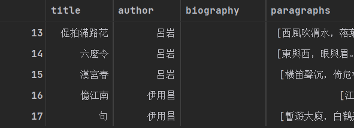

- To input the characters, UTF-8 encoding is not suitable. Chinese characters used in this poetries are much less than UTF-8. Therefore, we need to make some preprocess on it, representing Chinese in unique ID.

```python
中文词频 = dict()
for 诗歌 in poetries:
    for 中文 in 诗歌.values():
        if type(中文)==type(""):
            for 汉字 in 中文:
                中文词频[汉字] = 中文词频.get(汉字, 0) + 1
        elif type(中文)==type(['']):
            for paragraph in 中文:
                for 汉字 in paragraph:
                    中文词频[汉字] = 中文词频.get(汉字, 0) + 1
print(中文词频['月'])
len(中文词频)
中文到整数转换表 = dict()
for i, item in enumerate(items):
    中文到整数转换表[item[0]] = i
中文到整数转换表['月']
```

>  Note: It is for sure a good practice that we use Chinese Symbol in Python Programming Language in such project . They are natural and well supported by Python Interpreter.(Well, it seems every software other than GCC can handle UTF-8 well. )

- We may need to do some NLP steps suggested by some blogs on the internet too.[^2]

  - punctuation. 

  - words that are forbidden by some standard. (停用词)

  - word segmentation. 

- They may be done in some situations, while in others should not be done.[^2]We will then find some authors are of no name. They are invalid authors and we don't want they to be classified.

```python
## 生成作者表
作者频率 = {}
for 诗歌 in poetries:
    作者 = 诗歌['author']
    作者频率[作者] = 作者频率.get(作者,0)+1
print(作者频率['李白'])
print(len(作者频率))
print()
bad_author = ['不詳', '佚名', '無名氏', '無名', '匿名'
    , '子虚乌有', '張三', '子虛烏有', '某某', '某君', '逸名'
    , '不详', '无名氏']
for i in bad_author:
    print(作者频率.get(i, 0))
    if i in 作者频率:
        作者频率.pop(i)
# 去除掉不详和无名氏！
print()
for i in bad_author:
    print(作者频率.get(i, 0))
```

- 842+247 no name authors are cut off after this operation. Before, it was 2634 authors. 

```python
items = list(作者频率.items())
items.sort(key=lambda x:x[1], reverse=True)
items[0:5]
```

[('白居易', 2642), ('杜甫', 1158), ('李白', 896), ('齊己', 783), ('劉禹錫', 703)]

- Authors also needs to transform from UTF-8 or Chinese Alphabet to just classes number.

```python
作者到整数转换表 = dict()
for i, item in enumerate(items):
    作者到整数转换表[item[0]] = i
作者到整数转换表['李白']
```

- Since a kind poetry known as "古体诗" is really long, reaching 4000 words, we just try to keep the poetry to be short. We can limit the classification just to classify among "格律诗", which basically requires(but there are other requirements) that each sentence are either 5 words or 7 words, and there are 4 or 8 sentences. 

- Being short, we can easily pads the short poems with different lengths to be fixed-length

  ```python
  from tensorflow import keras
  七言律诗长度 = 7 * 8 + 1 * 8
  vocab_size = 7611 
  train_data = keras.preprocessing.sequence.pad_sequences(train_x,
                                                          value=vocab_size,
                                                          padding='post',
                                                          maxlen=七言律诗长度)
  
  test_data = keras.preprocessing.sequence.pad_sequences(test_x,
                                                         value=vocab_size,
                                                         padding='post',
                                                         maxlen=七言律诗长度)
  ```

   

### Exploratory data analysis

We have the following points to explore: 

- We are interested what "biography" and "notes" is, will they be useful?

  ```python
  有传记的 = []
  有注解的 = []
  for 诗歌 in poetries:
      if 诗歌['author'] in bad_author:
          continue
      if 诗歌['biography']!="":
          有传记的.append(诗歌)
      elif 诗歌['notes']!=[""]:
          有注解的.append(诗歌)
  print(len(有传记的))
  print(len(有注解的))
  有注解的[-5:-1] 
  ```

  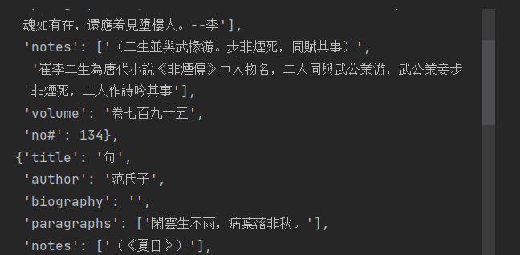

  We can see that there is not too much poems that have these two attributes, and they are not important. So we can drop it out. 

- Is the dataset balanced? Does every poet write the same amount of poetries?

  No, we can find that many authors that are not famous have only one poem handed down from ancient times. 

  ```python
  print(作者频率.items()[-100:-1]) # the least famous 100 peots all have only one poem.   
  ```

  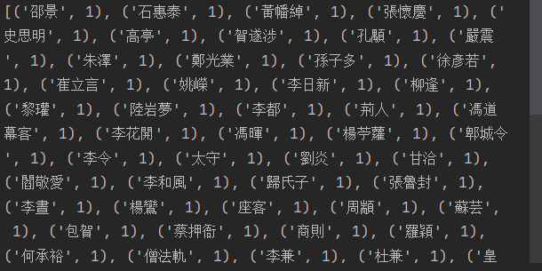

- How many poems a famous poet will write？

  ```python
  df['author'].plot.hist(bins=24, alpha=0.5, )
  ```

  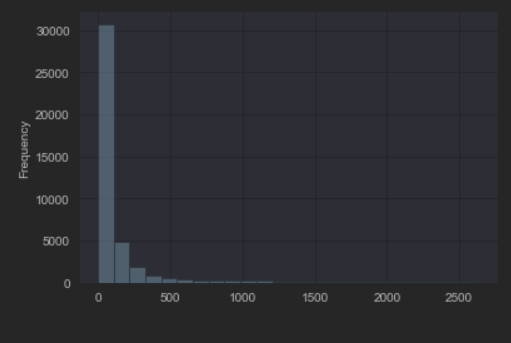

  The horizontal axis is the rank of poets according to the poetries count. The vertical axis is the poetries count. The histogram groups the poets of the similar ranks together as bins, and draw the frequency a bin owns. 

  We can see that among all 43103 poems, nearly 30000 of them are credited to the first class writers. The second class writers wrote only 1/6 poems as the first class wrote. 

- How many poems will be a lower bound of being a famous poet?

  ```python
  import matplotlib.pyplot as plt
  def draw(start = 0, step=5):
      a, b = start, start+step
      for plot_position in [221, 222, 223, 224]:
          plt.subplot(plot_position)
          plt.plot(filter_values[a:b], poets[a:b])
          a, b = b, b+step
  draw(10, 150)
  ```

  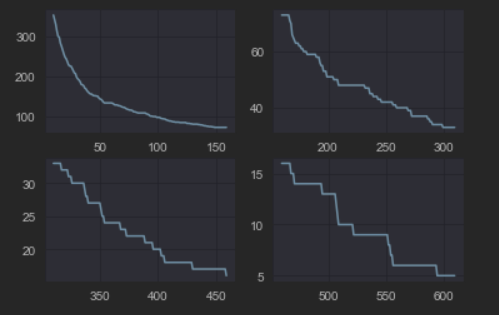

  The horizontal axis represents the lower bound for becoming famous. The vertical indicated the number of famous poets. The decreasing trend looks like a  1/x function.  

  We can find that the top 60 poets, considering the poems without long 古体诗, writes at least 95 poems. 

###  Model design

We will use the models taught in class, and try whether they are capable for this problem, in order to get a better understanding of them. They are

- Logistic Regression 
- Perceptron
- KNN
- Decision Tree
- Naïve Bayes
- SVM
- Ensemble learning

Then we will also try some Deep learning. 

## Experiment result and analysis

- Logistic Regression 

  Logistic Regression is the first successful classification idea, that utilize the Regression method to help. Linear regression has been research well, yet not suitable for classification, since its loss function will prefer the wrong but near prediction as a good one, which is not good. Therefore, Logistic Regression employed an activation function to it. But the Loss then became not convex, so CrossEntropyLoss came out. 

  Let's see if it will work on our dataset.

  ```python
  from sklearn.linear_model import LogisticRegression
  clf = LogisticRegression()
  clf.fit(train_data, train_label)
  clf.score(train_data, train_label)
  
  ```

  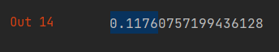

  We can see that even in training set, the linear model does not work well, leaving the testing set or validation set along.

  This is because the 64-dimension Feature Space we've provided to the model is far from linear.   

  - the label number is just a number, not having a numerical meaning. 

    - for logistic regression, the regression will think that the regression value accounts for the class.

  - The corresponding regression problem is far from linear. 

    We can do a linear regression for this.

    ```python
    from sklearn import linear_model
    from sklearn.metrics import mean_squared_error, r2_score
    reg = linear_model.LinearRegression()
    reg.fit(train_data, train_label)
    test_pred = reg.predict(test_data)
    print(reg.score(train_data, train_label))
    print('Mean squared error: %.2f'
          % mean_squared_error(test_label, test_pred))
    print('Coefficient of determination: %.2f'
          % r2_score(test_label, test_pred))
    train_pred = reg.predict(train_data)
    print('Coefficient of determination: %.2f'
          % r2_score(train_label, train_pred))
    ```

    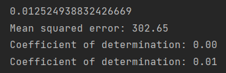

    It is clear that the R^2 score is nearly zero, meaning that the linear model does not account for any of the data. 

- Perceptron

  Perceptron, also called simple layer feedforward neutral network,[^1]  is a simple linear classification method. 

  In sklearn, Perceptron is [^4]

  - a special case of SGDClassifier, 

  ```python
  SGDClassifier(loss="perceptron", eta0=1, learning_rate="constant", penalty=None)
  ```

   		Perceptron learns only from the wrong samples, while other SGD algorithms do not. 

  - No regulation terms. No penalty.
  - Constant learning rate.
  - Multi class classification is done by "one to many", which is to use n classifiers for all n classes, telling whether the output is of that class.

  The first feature is important because it makes Perceptron trains fast. 

  Let's try it. 

  ```python
  from sklearn.linear_model import Perceptron
  clf = Perceptron()
  clf.fit(train_data, train_label)
  clf.score(train_data, train_label)
  ```

  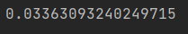

  Even much worse than Logistic Regression. 

  This is because the features are not linear separable. The perceptron converge rule fails to apply although it is really powerful, saying that any linear separable data will be separated in finite steps by Perceptron. 

- KNN

  KNN is an simple but strong method that can classify things. If the points that are of the same class are close together, KNN works well. 

  Sounds good. Let's see if it will work on our dataset.

  ```python
  from sklearn.neighbors import KNeighborsClassifier
  clf_knn = KNeighborsClassifier() 
  clf_knn.fit(train_data, train_label)
  print(clf_knn.score(train_data, train_label))
  print(clf_knn.score(test_data, test_label))
  ```

  

  We tuned the parameter K many times, but the performance is still poor. 

  Even on the training set, it is poor. This is because the Euclidean Distance is not suitable for describing the similarity of poetries. Out poetry vectors are just numbers that are encoded in our preprocessing step, and closed numbers just mean their word frequencies are closed. 

  Therefore, we need some other functions to describe the similarity better. 

  Liang et. al points out that the similarity of poetries can be done by using a cos distance of the embedded vector. And the embedded vector are obtained from BERT or LSTM model. The position of the poem sentence is also very important, Liang et.al allowed the sentences to be matched with the sentences in the other poetry, and a max flow of network is evaluated to be the final distance . By doing so, the similarity is found to be able to know the similarity of style and emotion.[^3] If we have this similarity implemented, KNN will surely be good. 

- Decision Tree

  Decision tree utilize Information Gain to train. It make decision by getting the information that can reduce the entropy first. 

  It seems a very reasonable method. Let's see if it will work on our dataset.

  ```python
  from sklearn import tree
  clf_tree = tree.DecisionTreeClassifier() 
  clf_tree.fit(train_data, train_label)
  print(clf_tree.score(train_data, train_label)) 
  clf_tree.score(test_data, test_label)
  ```

  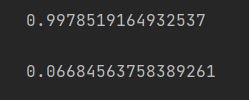

  Decision tree can always do well on training set, because it is very expressive. [^1]

  However, it does not work better than KNN on test sets. 

  This is because the decision is made by words at specific positions on our dataset. This is not reliable for poet classification. 李白 may wrote 月 at the 4th word many times, but this doesn't implies that having a 月 at the 4th word is the characteristic of 李白 poems. 

- Naïve Bayes

  Naïve Bayes applied the famous Bayesian rule from probability theory. The Problem P(y|X) is converted to P(X|y)P(y), which can be count by statistics if P(X|y) can be resolved to the multiplication of P(x|y) of every features. 

  Very sound math. Will it work on our dataset?

  ```python
  from sklearn.naive_bayes import BernoulliNB
  nb = BernoulliNB()
  test_pred = nb.fit(train_data, train_label).predict(test_data)
  print("Number of mislabeled points out of a total %d points : %d" % (test_data.shape[0], (test_label != test_pred).sum()))
  ```

  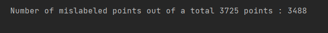

  0.063624, still a low accuracy. 

  This is because the probability a word occurs at a position is far from independent to another position. The assumption of our use of Bayes is wrong. 

  In fact, the basic NLP model N-gram is trying to solve this problem. It applied Markov assumption instead of our independent assumption. [^1]For example, In 3-gram model, $P(c_i|c_{1:i-1} = P(c_i|c_{i-2:i-1}))$.

- SVM

  SVM is the best perceptron we can have. It maximizes the margin distance. It can also handles non-linear separable data via kernel tricks. 

  We know that perceptron doesn't work well. Will SVM, with the help of soft margin and kernel trick, help us? 

  ```python
  from sklearn import svm
  clf_svm = svm.SVC(kernel='rbf')
  clf_svm.fit(train_data, train_label)
  clf_svm.score(train_data, train_label)
  ```

  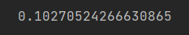

  Still not good even at training set. This is because the kernel trick is not good at this problem. Even it may help, it cannot solve any problems. 

- Ensemble learning

  If we have many weak classifiers, we can ensemble them to get a better one. 

  Great! May be this time it works?

  However, we tried `Bagging` `RandomForest` and `AdaBoost`, still a bad performance.

  This is because the base classifier we used 

  - are all not quite better than random. 
    - The accuracy of random agent for this problem is $1/60 = 0.016$ ，and although the method mentioned above are better, they are not so better.
  - are not independent
    - They are trained from the same data. 

  So the theorem did not apply.

- Deep learning

  Next, we try some simple deep learning with basic embedding layer and NN in tensorflow . 

  ```python
  vocab_size = 7611 + 1
  poets = 60
  
  model = keras.Sequential()
  model.add(keras.layers.GlobalAveragePooling1D())
  model.add(keras.layers.Dense(poets, activation='softmax', regularizers.l2(0.01)))
  model.summary()
  ```

  ```python
  model.compile(optimizer='adam',
                loss=tf.keras.losses.SparseCategoricalCrossentropy(from_logits=False),
                metrics=[tf.metrics.SparseCategoricalAccuracy()])
  ```

  ```python
  model.fit(train_data, train_label, epochs=100,verbose=1)
  ```
  
  
  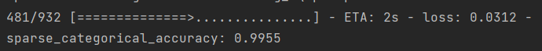
  
  Seems good at training set. 
  
  ```python
  model.evaluate(test_data, test_label, verbose=2)
  print(results) 
  ```

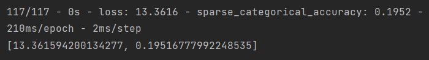

Wow, a simple embedding is ready powerful, compared to the methods above. 

If we can use the methods above with this together, the task can surely done better.  

## Conclusion

In this project, I have gained a hand by hand practice on machine learning, by 

- using Pandas, numpy, json, pickle for data preprocessing， 
- using Tensorflow and Sklearn for modeling
- tuning the parameters of the models.

After this project, I got a better understanding of the methods we learnt in class. 

There may be a illusion from MINIST and IRIS dataset that these methods works anywhere, but actually there is no algorithm that is always better than random if the problem is not limited.[^5] So I really have learnt a lesson when I found that these methods don't work. 

In conclusion, we know that simple and classical machine learning algorithms, while very ingenuous, will not work well when the feature is meaningless in physics. The agent will just learn nothing. There are two way to solve this

- "How much Artificial, how much Intelligence. " Invite a Chinese Poetry Specialist to extract some feature.
  - Every important words that can discriminate the poet are correspond to an one hot encoding, 1 means that the important word occurs.
- Apply a better NLP model. Use the deep learning techniques to extract the features automatically and effectively.  

Knowing that the second way is what so many papers and research are trying to do, I cannot wait to learn Deep Learning courses and do some further research on it! 

# References

[^1]: Stuartj. Russell, PeterNorvig, 诺维格, 罗素, 祝恩, and 殷建平, “人工智能:一种现代的方法,” 清华大学出版社, 2013, doi: [9787302331094](https://doi.org/9787302331094).
[^2]: [( 自然语言处理任务中标点和停用词到底该不该去掉？ - 知乎 (zhihu.com)](https://www.zhihu.com/question/296573656)
[^3]: 梁健楠, 孙茂松, and 矣晓沅, “基于深度神经网络的诗词检索,” 中文信息学报, vol. 34, no. 12, pp. 82–91, 2020.

[^4]: “scikit-learn中文社区.” https://scikit-learn.org.cn/ (accessed Aug. 04, 2022).
[^5]: 周志华, 机器学习. 清华大学出版社, 2016. Accessed: Jul. 16, 2022. [Online]. Available: https://book.douban.com/subject/26708119/

